License: GPLv3

# Escrow Pallet Testing Guide (Ubuntu)

## Prerequisite Setup
### Install Dependencies 
```
sudo apt install build-essential
sudo apt install -y git clang curl libssl-dev llvm libudev-dev
```

### Install Rust
```
curl --proto '=https' --tlsv1.2 -sSf https://sh.rustup.rs | sh -s -- -y

source ~/.cargo/env

rustup default stable

rustup update stable

rustup update nightly

rustup install nightly-2022-09-19 

rustup override set nightly-2022-09-19

rustup target add wasm32-unknown-unknown

rustup target add wasm32-unknown-unknown --toolchain nightly
```
## Deploy a Local Ventur Node
### Fetch the code
 The following command pulls the ventur-node code from our github repo:

```
git clone https://github.com/PopularCoding/ventur

cd ventur
 ```
 
 ### Run the node
 The following command builds the node. (This may take some time):
 ```
cargo run --release -- --dev
```

## Run Unit Tests
Unit tests can be run locally using the following command:
``` 
cargo test
``` 

## Manual Test Guide

### 1. Start the node
 ```
cargo run --release -- --dev
```

| _Running your local node_ |
|:--:|
|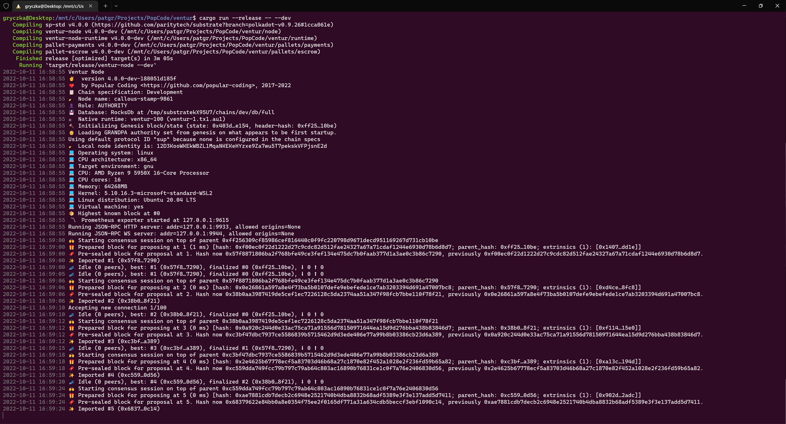|

### 2. Access the Node through the polkadot.js.org interface
Once you have a ventur node running locally, follow this link:
https://polkadot.js.org/apps/?rpc=ws%3A%2F%2F127.0.0.1%3A9944#/explorer

| _Accessing your Development Node Endpoint in polkadot.js.org_ |
|:--:|
|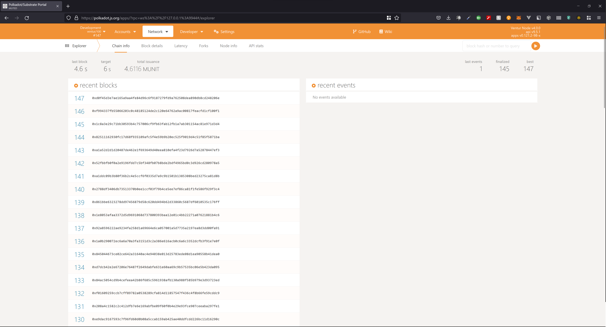|

_Confirm that you can see the recent blocks listed._
If you are not able to access the block explorer on polkadot.js.org, you should:
1. Confirm that your Ventur node is running
2. Check if your Ventur node is running the JSON-RPC WS server on an address and port other than ```127.0.0.1:9944```
    a. If your node is running on a different address and port, update the custom endpoint in polkadot.js.org to the address and port number your node is serving

    | _Setting your Development Node Endpoint in polkadot.js.org_ |
    |:--:|
    |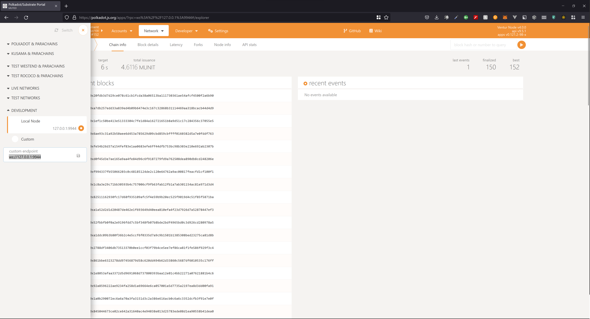|

### 3. Test Creating an Escrow
| _Create an Escrow_ |
|:--:|
|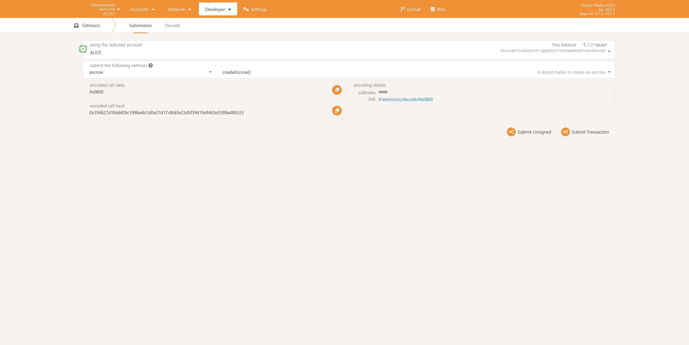|
### 4. Test Funding an Escrow
First check your account to see the Transferable Balance listed for `Alice`
| _Check Balance_ |
|:--:|
|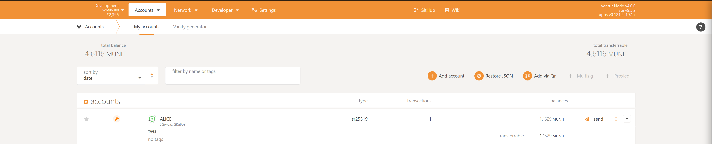|
Next, call the `fundEscrow` extrinsic with a balance of:
 `1000000000000000000`
| _Fund Escrow_ |
|:--:|
|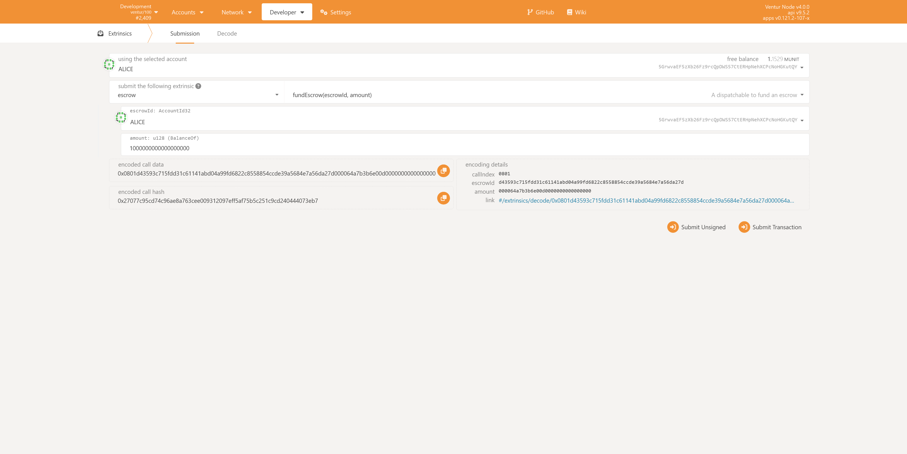|
And back in accounts, confirm that the funded amount is now locked for `Alice`
| _Confirm Locked Funds_ |
|:--:|
|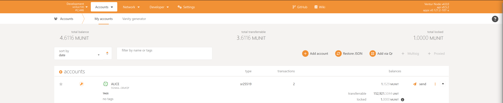|

#### 4.a. Test Open Contributions on an Escrow
##### 4.a.i. Admin Contribution
Now that `Alice` has created an Escrow, we can confirm that by default the escrow only allows admin contributions.
Have `AliceStash` attempt to fund `Alice`'s escrow.  This should bring up an `Unauthorized` error message.
| _Attempt to Fund `Alice`'s Escrow from `AliceStash`_ |
|:--:|
|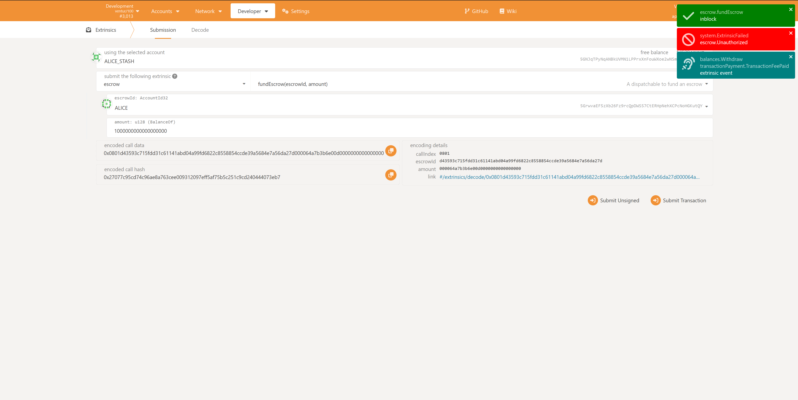|
Confirm in accounts that `Alice` and `AliceStash`'s balances have not changed.
| _Confirm Account Balances After Funding_ |
|:--:|
|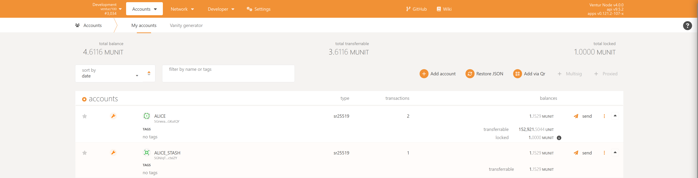|
Next add `AliceStash` as an admin to `Alice`'s Escrow.
| _Add AliceStash as Admin_ |
|:--:|
|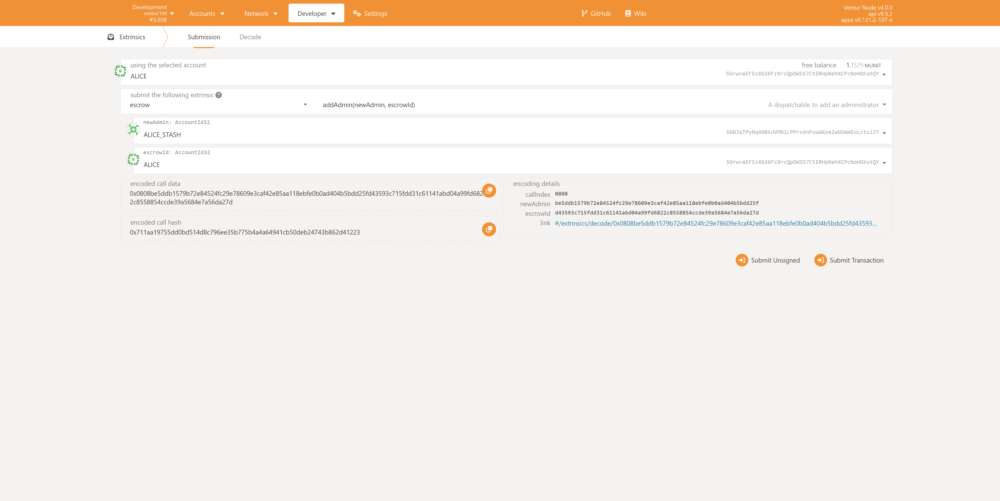|
And now attempt to fund escrow from `AliceStash` again, this time it should result in a success.
| _Fund `Alice`'s Escrow from `AliceStash`_ |
|:--:|
|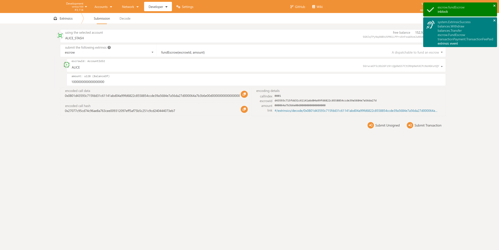|
Confirm the expected balance change for `Alice` and `AliceStash`.
| _Confirm Balance of `Alice` and `AliceStash`_ |
|:--:|
|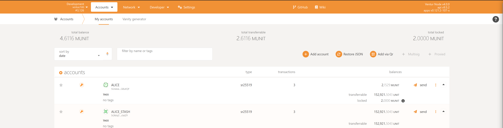|
##### 4.a.ii. Open Contribution
Next confirm the starting balance of `Bob`'s account.
| _Confirm Balance of `Bob`_ |
|:--:|
|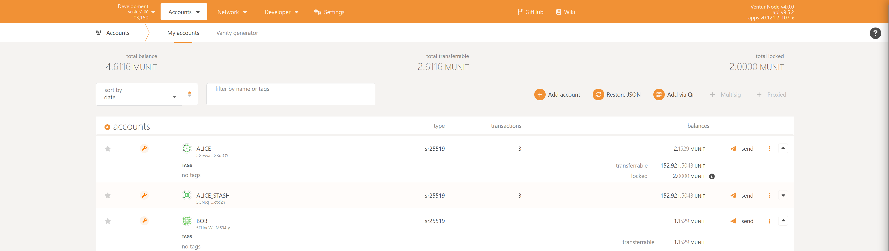|
Next attempt to call fund escrow on `Alice` from `Bob`, this should fail as `Bob` is not an admin.
| _Attempt to Fund with `Bob`_ |
|:--:|
||
Next have Alice call the `enableOpenContribution` extrinsic
| _`Alice` Enable Open Contribution_ |
|:--:|
|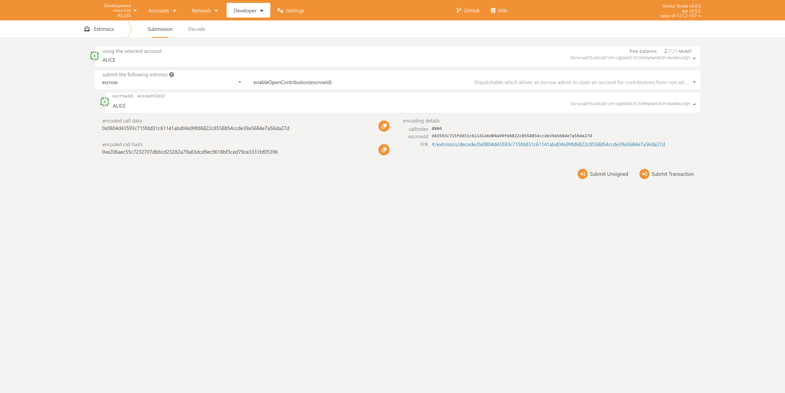|
And now have `Bob` attempt to fund `Alice` again
| _Fund with `Bob`_ |
|:--:|
||
And confirm the balance changes for `Bob` and `Alice`
| _Confirm Balance of `Alice` and `AliceStash`_ |
|:--:|
||
### 5. Test Distributing from an Escrow
Take note of `Charlie`'s balance.
| _Take note of `Charlie`'s balance_ |
|:--:|
|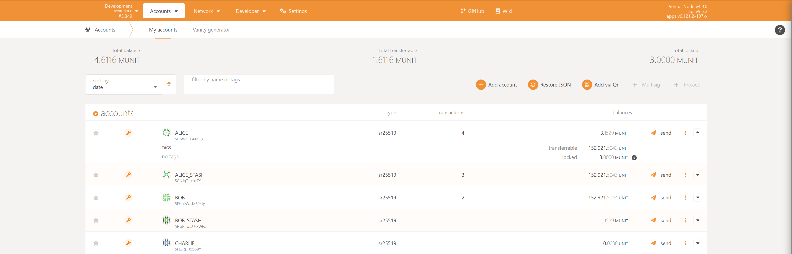|
Have `Alice` distribute to `Charlie`.
| _`Alice` calls the payoutEscrow extrinsic to `Charlie`_ |
|:--:|
|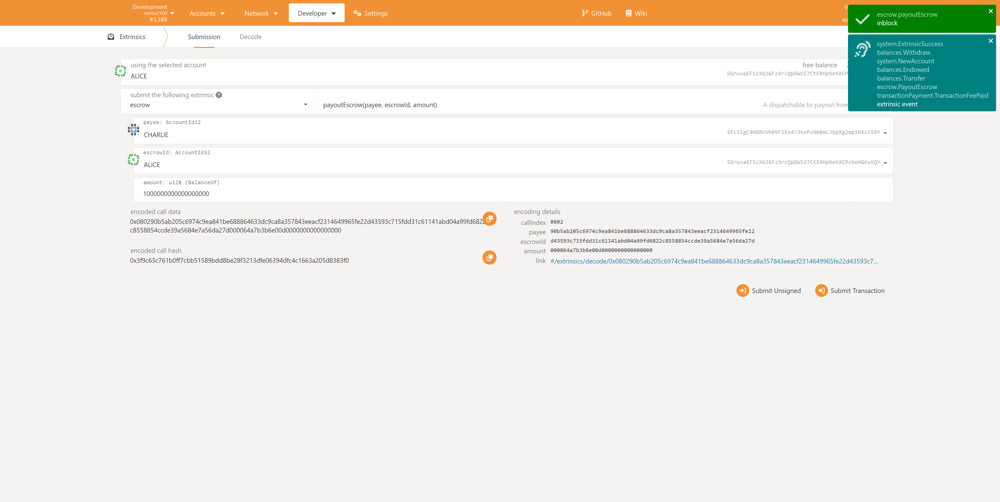|
Confirm `Charlie` and `Alice`'s balance after distribution.
| _Confirm Balance of `Charlie`_ |
|:--:|
|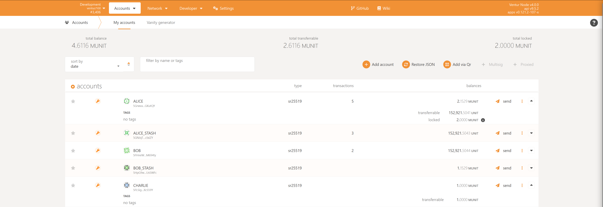|
### 6. Test Freezing an Escrow
Using `Alice` call the `freezeEscrow` extrinsic.
| _Freeze `Alice`_ |
|:--:|
||
Attempt to fund `Alice` with `10000000000000000` (less than the previous amounts, as Alice currently has less than the previously used `1MUNIT`).  This should fail with an `escrow Frozen` error.
| _Attempt to Fund `Alice`_ |
|:--:|
|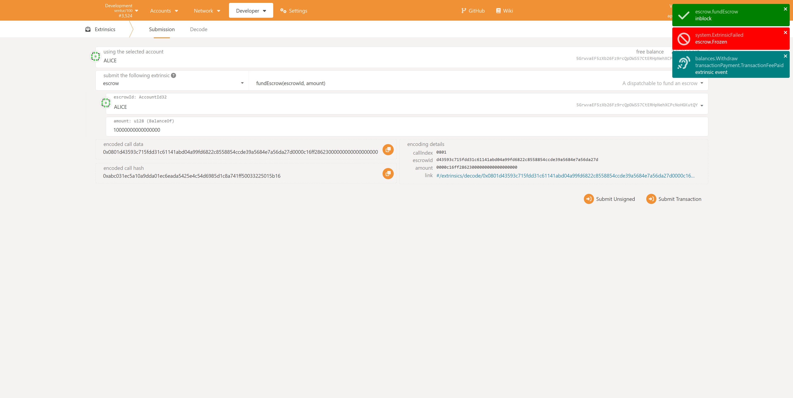|
Next thaw `Alice`
| _Thaw `Alice`_ |
|:--:|
|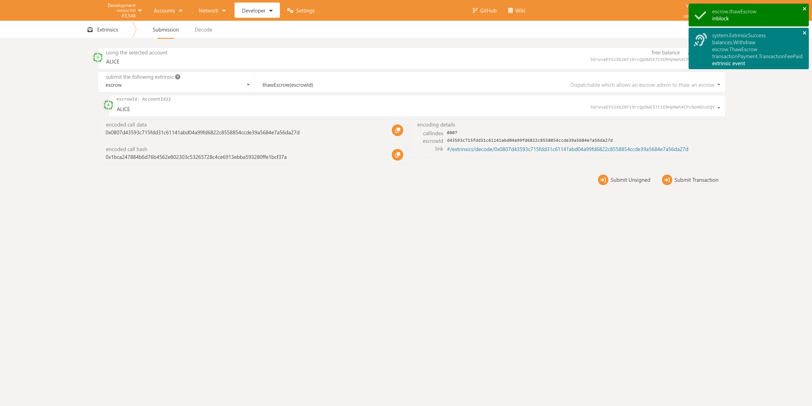|
Attempt to fund `Alice` with `10000000000000000` again.
| _Attempt to Fund `Alice`_ again |
|:--:|
|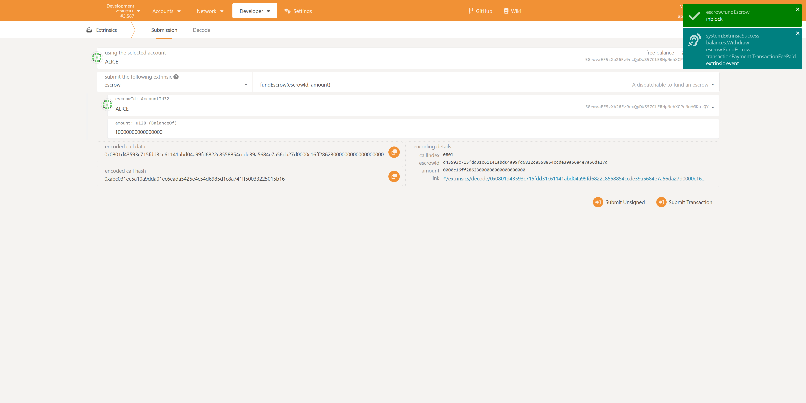|
### 7. Test Closing an Escrow
Using `Alice` call the `closeEscrow` extrinsic.
| _Close `Alice`_ |
|:--:|
|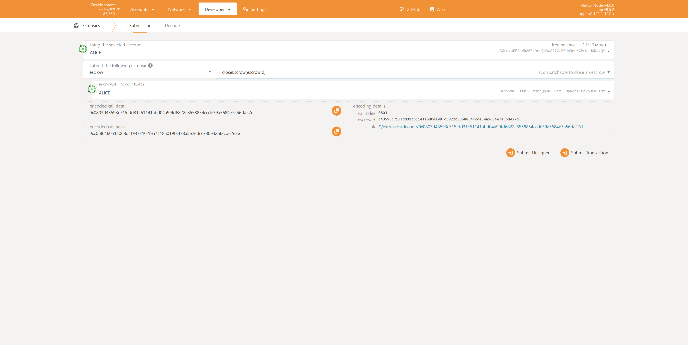|
