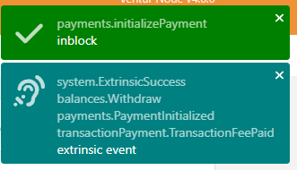

License: GPLv3

# Escrow Pallet Testing Guide (Ubuntu)

## Prerequisite Setup
### Install Dependencies 
```
sudo apt install build-essential
sudo apt install -y git clang curl libssl-dev llvm libudev-dev
```

### Install Rust
```
curl --proto '=https' --tlsv1.2 -sSf https://sh.rustup.rs | sh -s -- -y

source ~/.cargo/env

rustup default stable

rustup update stable

rustup update nightly

rustup install nightly-2022-09-19 

rustup override set nightly-2022-09-19

rustup target add wasm32-unknown-unknown

rustup target add wasm32-unknown-unknown --toolchain nightly
```
## Deploy a Local Ventur Node
### Fetch the code
 The following command pulls the ventur-node code from our github repo:

```
git clone https://github.com/PopularCoding/ventur

cd ventur
 ```
 
 ### Run the node
 The following command builds the node. (This may take some time):
 ```
cargo run --release -- --dev
```

## Run Unit Tests
Unit tests can be run locally using the following command:
``` 
cargo test
``` 

## Manual Test Guide

### 1. Start the node
 ```
cargo run --release -- --dev
```

| _Running your local node_ |
|:--:|
||

### 2. Access the Node through the polkadot.js.org interface
Once you have a ventur node running locally, follow this link:
https://polkadot.js.org/apps/?rpc=ws%3A%2F%2F127.0.0.1%3A9944#/explorer

| _Accessing your Development Node Endpoint in polkadot.js.org_ |
|:--:|
||

Confirm that you can see the recent blocks listed.
If you are not able to access the block explorer on polkadot.js.org, you should:
1. Confirm that your Ventur node is running
2. Check if your Ventur node is running the JSON-RPC WS server on an address and port other than ```127.0.0.1:9944```
    a. If your node is running on a different address and port, update the custom endpoint in polkadot.js.org to the address and port number your node is serving

    | _Setting your Development Node Endpoint With the Payments Pallet_ |
    |:--:|
    ||

### 3. Test Out Functionality
#### Initialize A One-Time Payment
1. Select `payments` in the dropdown under `submit the following extrinsic`
2. Select the `initializePayment` extrinsic in the next dropdown
3. Select the appropriate actor to be the payer id
4. Fill out the fields with the desired values (Note: if you'd like to test out claiming a payment, make sure the unixtime is soon enough to collect the payment within this testing session)
5. Submit the transaction
    | _Initializing a One-Time Payment in polkadot.js.org_ |
    |:--:|
    ||
    
    
    | _Transaction Succeeded_ |
    |:--:|
    ||
    
#### Claim a Payment
1. Select `payments` in the dropdown under `submit the following extrinsic`
2. Select the `claim` extrinsic in the next dropdown
3. Make sure the acting account matches the `payee_id` field from your payment initialization
4. Make sure the `payer_id` field matches the acting account from your payment initialization
5. Submit the transaction. You should see a successful transaction

    | _Claiming Payment With the Payments Pallet_ |
    |:--:|
    ||
    
#### Initialize Scheduled Payments
1. Follow the same steps lined out in the Initialize One-Time Payment Section
2. In Scheduled Payments, click on `Add Item`
3. Add as many payments as you'd like to test, choosing the scheduled unixtime for payment release
4. Submit the transaction

    | _Scheduling Multiple Payments_ |
    |:--:|
    ||
    
#### Claiming Unavailable Payments
1. Follow the same steps lined out in the Claim a Payment Section
2. Try to claim as many payments as you'd like
3. If you have scheduled a payment for a future time, the transaction should fail

    
    | _Claiming An Unavailable Payment_ |
    |:--:|
    ||
