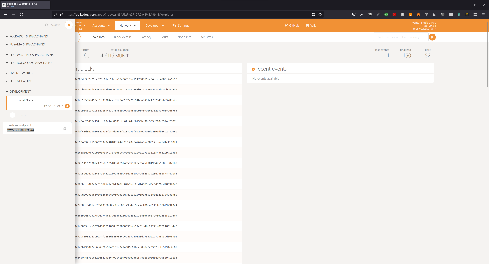
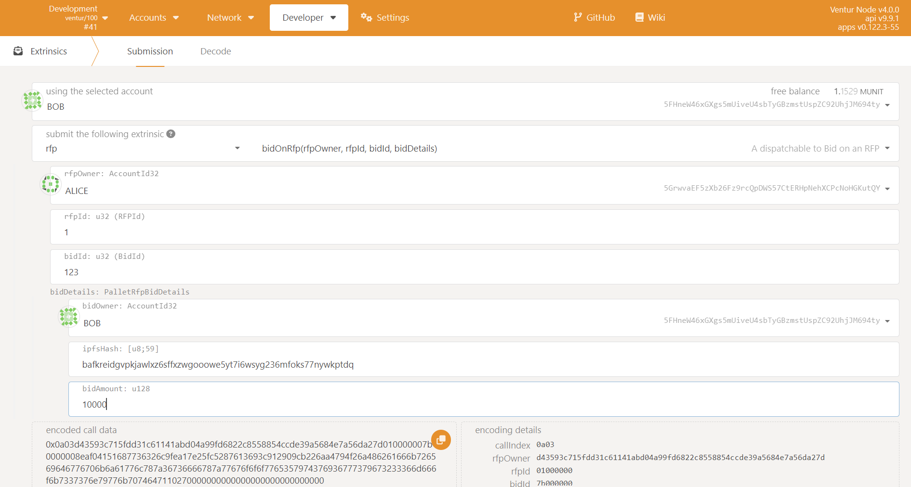

# RFP Pallet

<div align="center">

[](https://github.com/Popular-Coding/ventur/blob/main/LICENSE)
[](https://docs.ventur.network/pallet_rfp/index.html)
</div>

## RFP Pallet Setup and Testing Guide (Ubuntu)

### Prerequisite Setup

#### Install Dependencies

```bash
sudo apt install build-essential
sudo apt install -y git clang curl libssl-dev llvm libudev-dev
```

#### Install Rust

```bash
curl --proto '=https' --tlsv1.2 -sSf https://sh.rustup.rs | sh -s -- -y

source ~/.cargo/env

rustup default stable

rustup update stable

rustup update nightly

rustup install nightly-2022-09-19 

rustup override set nightly-2022-09-19

rustup target add wasm32-unknown-unknown

rustup target add wasm32-unknown-unknown --toolchain nightly
```

### Deploy a Local Ventur Node

#### Fetch the code

The following command pulls the ventur-node code from our github repo:

```bash
git clone https://github.com/PopularCoding/ventur

cd ventur
```

#### Run the node

The following command builds the node. (This may take some time):

```bash
cargo run --release -- --dev
```

### Run Unit Tests

Unit tests can be run locally using the following command:

```bash
cargo test
```

### Manual Test Guide

#### 1. Start the node

```bash
cargo run --release -- --dev
```

| _Running your local node_ |
|:--:|
||

#### 2. Access the Node through the polkadot.js.org interface

Once you have a ventur node running locally, follow this link:
[https://polkadot.js.org/apps/?rpc=ws://127.0.0.1:9944#/explorer](https://polkadot.js.org/apps/?rpc=ws://127.0.0.1:9944#/explorer)

| _Accessing your Development Node Endpoint in polkadot.js.org_ |
|:--:|
||

_Confirm that you can see the recent blocks listed._
If you are not able to access the block explorer on polkadot.js.org, you should:

1. Confirm that your Ventur node is running
2. Check if your Ventur node is running the JSON-RPC WS server on an address and port other than ```127.0.0.1:9944```
    a. If your node is running on a different address and port, update the custom endpoint in polkadot.js.org to the address and port number your node is serving

    | _Setting your Development Node Endpoint in polkadot.js.org_ |
    |:--:|
    ||

3. Navigate to Developer &rarr; Extrinsics

#### 3. Testing the RFP Extrinsics

##### Create an RFP

| _Creating An RFP_ |
|:--:|
||

1. Navigate to the `createRFP` extrinsic
2. Select your RFP owner and input an RFP ID
3. Input the RFP IPFS Content Identifier (CID). This is a hash referring to the address based on the stored content. Modifying the contents stored in IPFS will modify the CID itself. More details can be found [here](https://docs.filebase.com/ipfs/ipfs-cids). If you don't have your own CID, for testing purposes, feel free to use this dummy CID: 

        bafkreidgvpkjawlxz6sffxzwgooowe5yt7i6wsyg236mfoks77nywkptdq

4. Click on the `Submit Transaction` button.
5. If you try to create an RFP another RFP with the same parameters, you'll see the transaction fail:

| _Re-Creating An RFP_ |
|:--:|
||

##### Updating an RFP

Instead, you can modify the RFP using the `updateRFP` extrinsic:

1. Make sure you submit the correct owner and `rfpId`, otherwise the transaction will fail:

| _Updating An RFP That Doesn't Exist_ |
|:--:|
||

2. Add your updated CID, and click `Submit Transaction`:

| _Update An RFP_ |
|:--:|
||

##### Bid On RFP

Once you're ready to bid on an RFP, navigate to the `bidOnRFP` extrinsic

1. Input the RFP Owner Id
2. Input an existing RFPId
2. Input a unique Bid Id
3. Fill in the bid details, including the owner of the bid, the CID of the the bid stored in IPFS, and the proposed Payment Amount associated with the bid
4. Click on `Submit Transaction`

| _Bid On An RFP_ |
|:--:|
||

##### Update A Bid

If you've found yourself updating your bid details in IPFS, you'll have generated a new CID for that bid. To update the details in storage, navigate to the `updateRFPBid` extrinsic.

1. Fill in the correct `rfpId`, `bidId`, and the updated bid details.
2. Click `Submit Transaction`

| _Update a Bid_ |
|:--:|
||

##### Shortlist A Bid

You won't be able to accept a bid before shortlisting, so in order to shortlist an exsting bid, navigate to the `shortlistBid` extrinsic.

1. Select the appropriate RFP Owner
2. Fill in the fields for the `rfpId` and `bidId`
3. Click `Submit Transaction`

| _Shortlist a Bid_ |
|:--:|
||

##### Accept A Bid

Finally, you can now accept a bid for your RFP. Navigate to the `acceptRfpBid` extrinsic

1. Select the appropriate RFP Owner
2. Fill in the fields for the `rfpId` and the `bidId`
3. Fill out all the payment details associated with the accepting of this RFP Bid
4. Click `Submit Transaction`

| _Accepting a Bid_ |
|:--:|
||

##### Claiming A Payment

You can now even claim your first payment if you've filled out your payment details correctly. Navigate to the `payments` pallet and the `claim` extrinsic. 

1. Select the claimant of the plaiment as the actor
2. Fill in the `payerId` and the `paymentId`
3. Click `Submit Transaction`

| _Claiming A Payment_ |
|:--:|
||