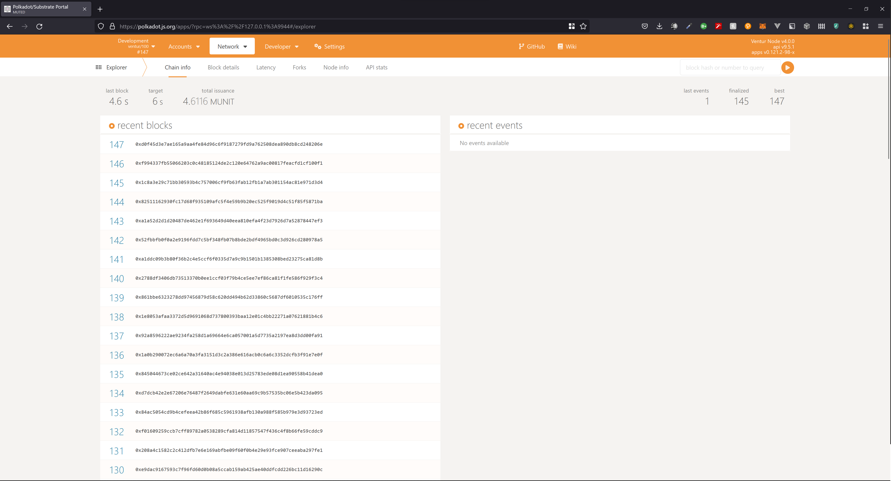

# RFP Pallet

<div align="center">

[](https://github.com/Popular-Coding/ventur/blob/main/LICENSE)
[](https://docs.ventur.network/pallet_rfp/index.html)
</div>

## RFP Pallet Setup and Testing Guide (Ubuntu)

### Prerequisite Setup

#### Install Dependencies

```bash
sudo apt install build-essential
sudo apt install -y git clang curl libssl-dev llvm libudev-dev
```

#### Install Rust

```bash
curl --proto '=https' --tlsv1.2 -sSf https://sh.rustup.rs | sh -s -- -y

source ~/.cargo/env

rustup default stable

rustup update stable

rustup update nightly

rustup install nightly-2022-09-19 

rustup override set nightly-2022-09-19

rustup target add wasm32-unknown-unknown

rustup target add wasm32-unknown-unknown --toolchain nightly
```

### Deploy a Local Ventur Node

#### Fetch the code

The following command pulls the ventur-node code from our github repo:

```bash
git clone https://github.com/PopularCoding/ventur

cd ventur
```

#### Run the node

The following command builds the node. (This may take some time):

```bash
cargo run --release -- --dev
```

### Run Unit Tests

Unit tests can be run locally using the following command:

```bash
cargo test
```

### Manual Test Guide

#### 1. Start the node

```bash
cargo run --release -- --dev
```

| _Running your local node_ |
|:--:|
||

#### 2. Access the Node through the polkadot.js.org interface

Once you have a ventur node running locally, follow this link:
[https://polkadot.js.org/apps/?rpc=ws://127.0.0.1:9944#/explorer](https://polkadot.js.org/apps/?rpc=ws://127.0.0.1:9944#/explorer)

| _Accessing your Development Node Endpoint in polkadot.js.org_ |
|:--:|
||

_Confirm that you can see the recent blocks listed._
If you are not able to access the block explorer on polkadot.js.org, you should:

1. Confirm that your Ventur node is running
2. Check if your Ventur node is running the JSON-RPC WS server on an address and port other than ```127.0.0.1:9944```
    a. If your node is running on a different address and port, update the custom endpoint in polkadot.js.org to the address and port number your node is serving

    | _Setting your Development Node Endpoint in polkadot.js.org_ |
    |:--:|
    ||
