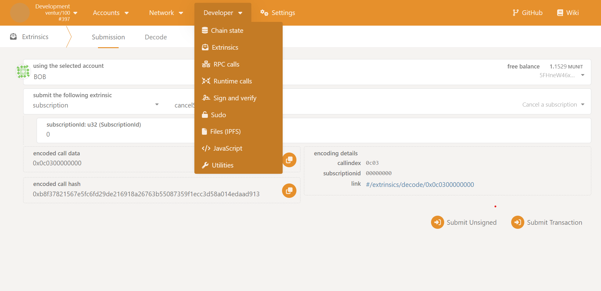
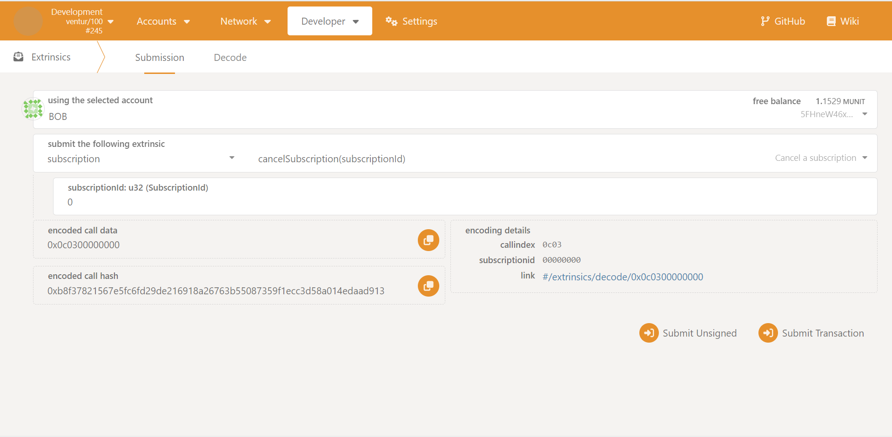
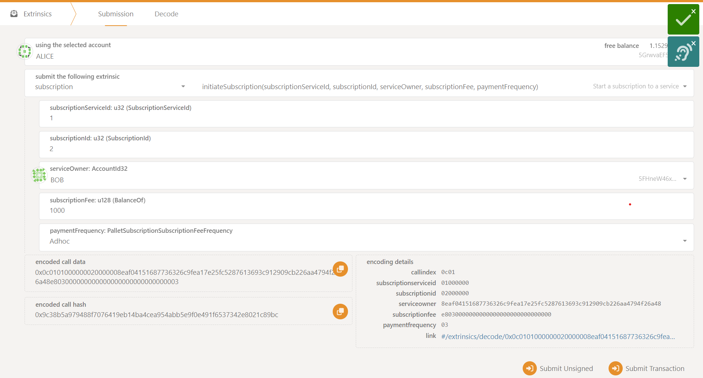
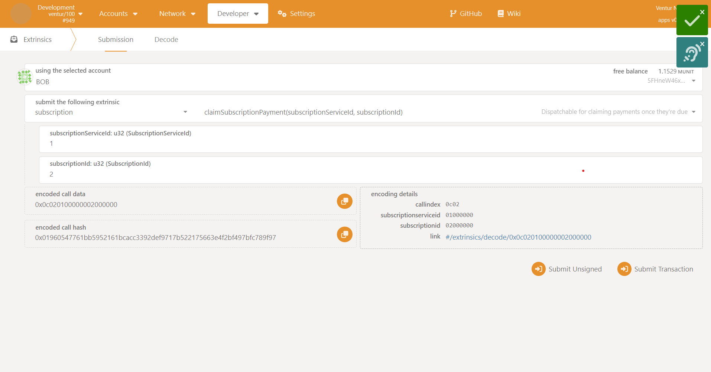
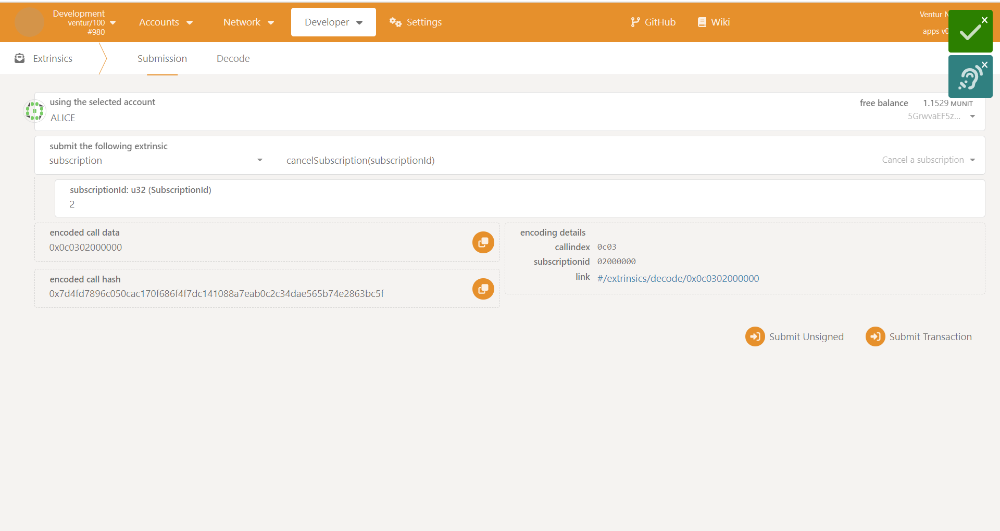
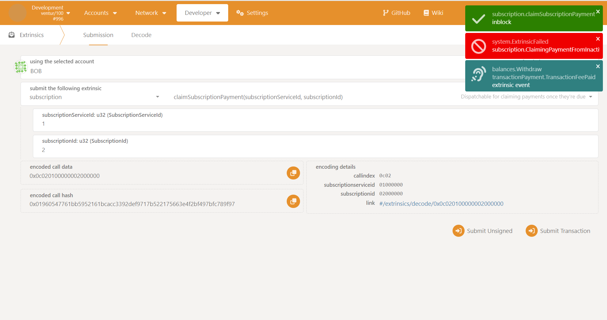

# Subscription Pallet

<div align="center">

[](https://github.com/Popular-Coding/ventur/blob/main/LICENSE)


</div>

## Subscription Pallet Setup and Testing Guide (Ubuntu)

### Prerequisite Setup

#### Install Dependencies

```bash
sudo apt install build-essential
sudo apt install -y git clang curl libssl-dev llvm libudev-dev
```

#### Install Rust

```bash
curl --proto '=https' --tlsv1.2 -sSf https://sh.rustup.rs | sh -s -- -y

source ~/.cargo/env

rustup default stable

rustup update stable

rustup update nightly

rustup install nightly-2022-09-19 

rustup override set nightly-2022-09-19

rustup target add wasm32-unknown-unknown

rustup target add wasm32-unknown-unknown --toolchain nightly
```

### Deploy a Local Ventur Node

#### Fetch the code

The following command pulls the ventur-node code from our github repo:

```bash
git clone https://github.com/PopularCoding/ventur

cd ventur
```

#### Run the node

The following command builds the node. (This may take some time):

```bash
cargo run --release -- --dev
```

### Run Unit Tests

Unit tests can be run locally using the following command:

```bash
cargo test
```

### Manual Test Guide

#### 1. Start the node

```bash
cargo run --release -- --dev
```

| _Running your local node_ |
|:--:|
||

#### 2. Access the Node through the polkadot.js.org interface

Once you have a ventur node running locally, follow this link:
[https://polkadot.js.org/apps/?rpc=ws://127.0.0.1:9944#/explorer](https://polkadot.js.org/apps/?rpc=ws://127.0.0.1:9944#/explorer)

| _Accessing your Development Node Endpoint in polkadot.js.org_ |
|:--:|
||

_Confirm that you can see the recent blocks listed._
If you are not able to access the block explorer on polkadot.js.org, you should:

1. Confirm that your Ventur node is running
2. Check if your Ventur node is running the JSON-RPC WS server on an address and port other than ```127.0.0.1:9944```
    a. If your node is running on a different address and port, update the custom endpoint in polkadot.js.org to the address and port number your node is serving

    | _Setting your Development Node Endpoint in polkadot.js.org_ |
    |:--:|
    ||

#### 3. Test Out Functionality Using the polkadot.js.org Interface

##### Navigating to the Subscription Interface
In the UI, navigate to the developer dropdown, and select `Extrinsics`

| _Nav_ |
|:--:|
||

In the `submit the following extrinsic` dropdown, select `subscription`

| _Subscription home_ |
|:--:|
||

##### Create a Subscription Service

1. Select the `createSubscriptionService` extrinsic in the dropdown
2. Select your desired subscription service owner
3. Fill in the `subscriptionServiceId` field with your desired subscription service id
4. Fill in the base subscription fee
5. Select your default payment schedule in the dropdown 
6. Type in a ipfs cid. You can choose your own, or use this sample one: `Qmb232AquR57EMUGgU92TxeZ8QyAJF5nERjdPZRNNJoh6z`
7. Click `Submit Transaction`


| _Creating a subscription service_ |
|:--:|
||

##### Adding a Subscription

1. Select the `initiateSubscription` extrinsic in the dropdown
2. Choose your desired subscriber
3. In the `SubscriptionServiceId` field, input an id of an already-existing subscription service (See Create a Subscription Service Section to create a subscription service)
4. Add a Subscription Id for your subscription
5. Select the owner of the service
6. Input how much the subscription service will cost, and the frequency of payment (For more immediate payment, select Adhoc)
7. Click `Submit Transaction`

| _Adding a subscription_ |
|:--:|
||

##### Claiming a Subscription Payment

1. Select the `claimSubscriptionPayment` extrinsic in the dropdown
2. Make sure the selected account is the subscription service owner
3. In the `SubscriptionServiceId` field, input an id of an already-existing subscription service (See Create a Subscription Service Section to create a subscription service)
4. In the `SubscriptionId` field, input an id of an already-existing subscription id (See Adding a Subscription Section to add a subscription)
5. Click `Submit Transaction`

| _Claiming A Payment_ |
|:--:|
||

##### Cancelling A Subscription

1. Select the `cancelSubscription` extrinsic in the dropdown
2. Make sure the selected account is the owner of the subscription
3. In the `SubscriptionId` field, input an id of an already-existing subscription id (See Adding a Subscription Section to add a subscription)
4. Click `Submit Transaction`

| _Cancel A Subscription_ |
|:--:|
||

5. Now if you try to claim the subscription, the call should fail


| _Claiming Payment From A Canceled Subscription_ |
|:--:|
||